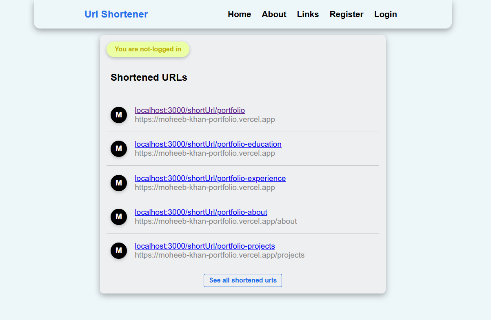
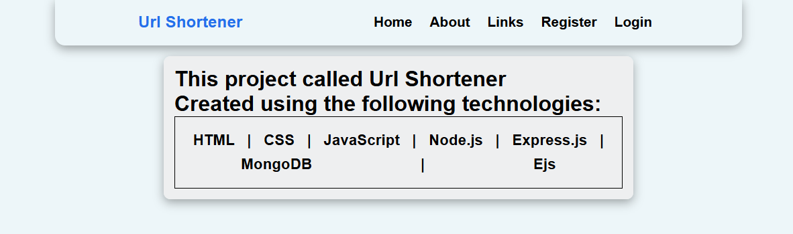
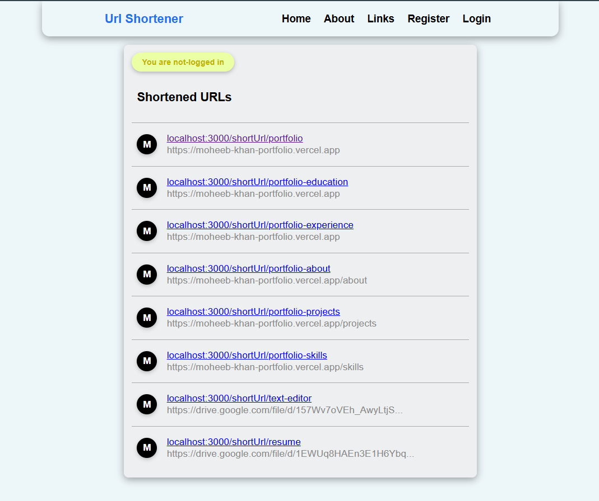
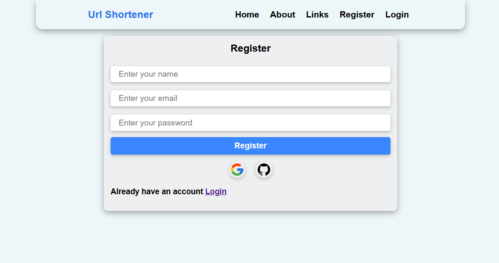
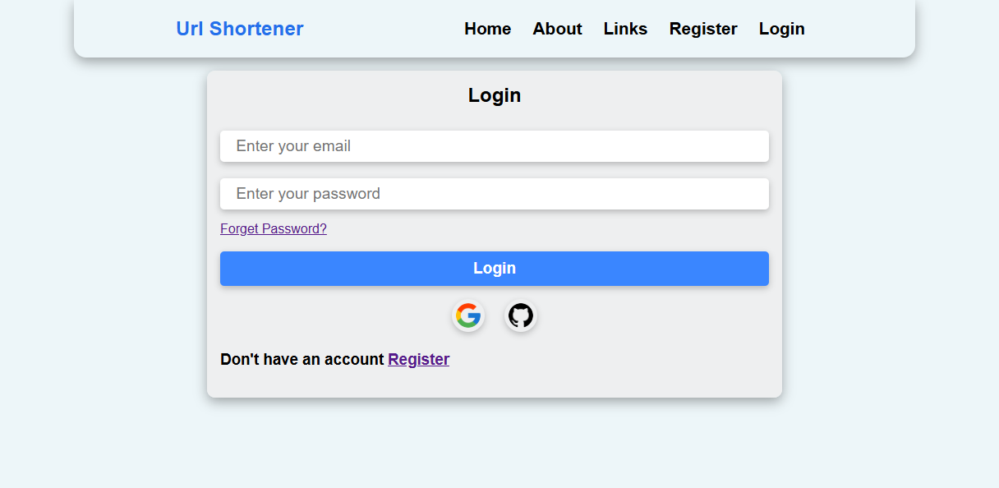
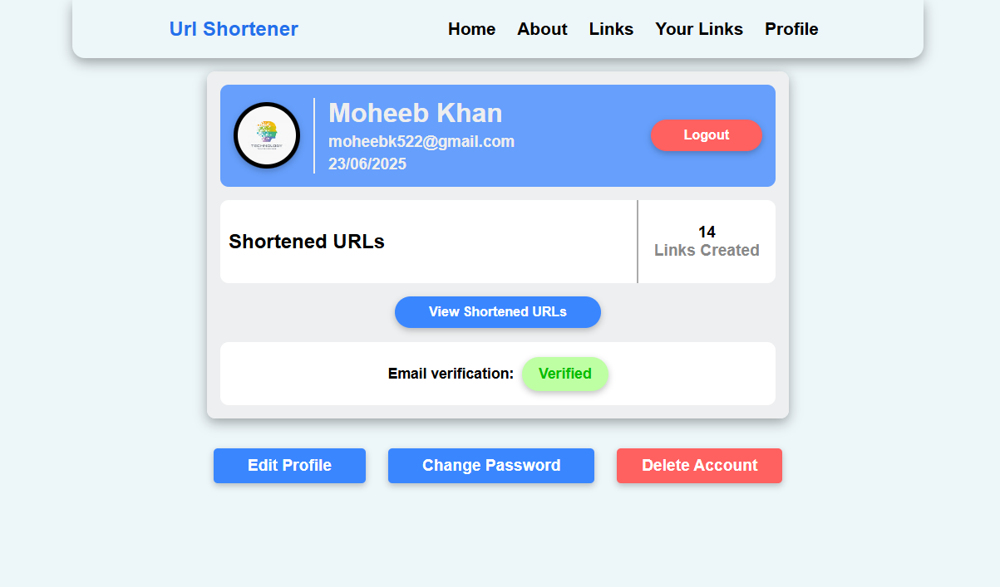
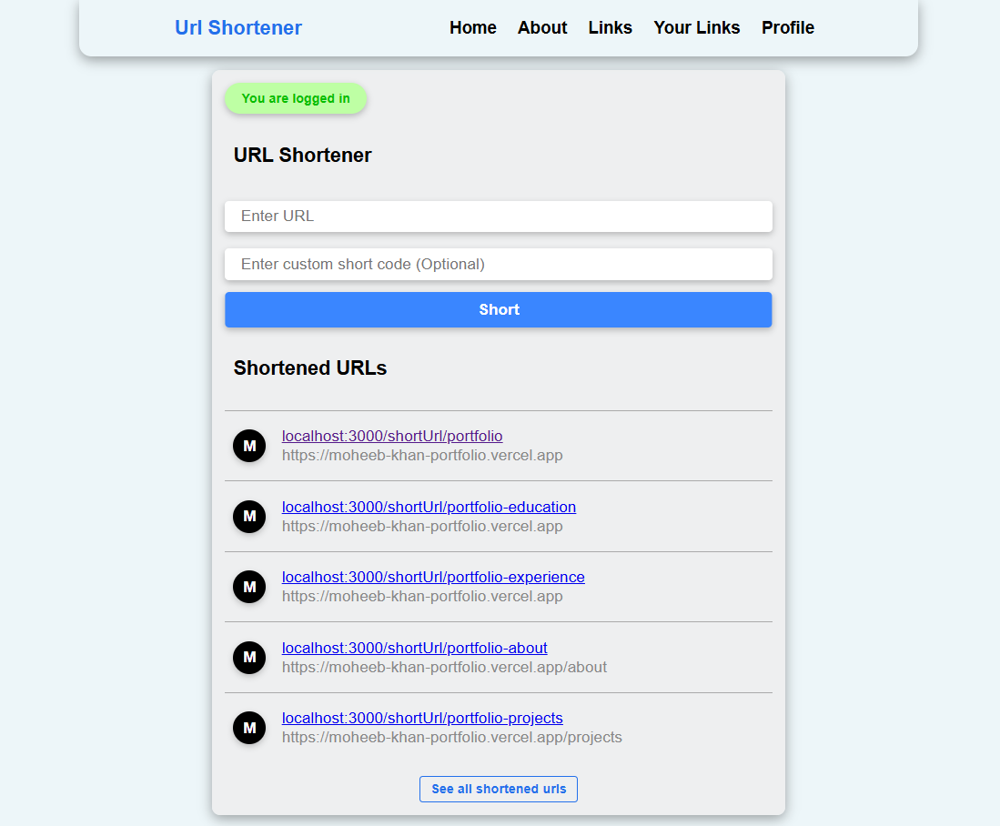
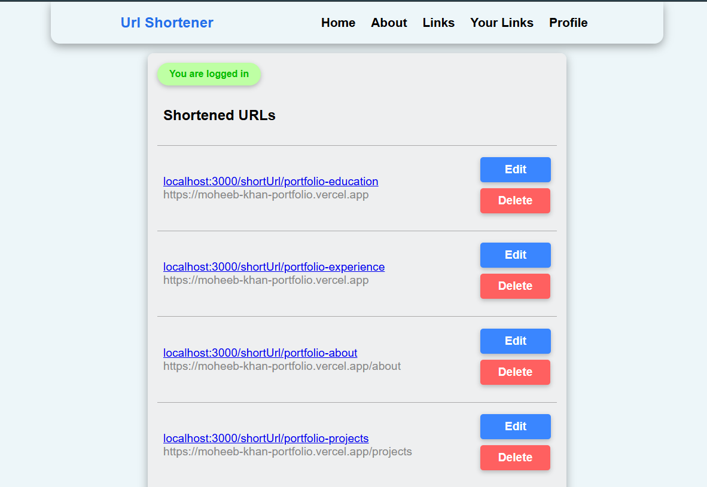

# 🔗 URL Shortener

A full-featured URL Shortener application built with **Node.js**, **Express**, and **MongoDB**. It allows users to shorten long URLs into concise short links, manage them securely, and track redirection—all in a simple and clean web interface.

## 🚀 Features

- 🔐 User authentication (session-based with JWT)
- ✂️ Shorten long URLs
- 📊 Redirect short URLs to original URL
- 🧑‍💼 User profile to manage and view account
- 🧑‍💼 User dashboard to manage links and redirection
- 💾 MongoDB for data persistence
- 🧩 EJS templating for views
- ☁️ Cloudinary integration for avatar uploads
- ✉️ Flash messages and form validations

---

## 📁 Project Structure

- 📁 config           # Folder for configurations
- 📁 controllers      # Folder for controller functions
- 📁 middlewares      # Folder for middleware logic
- 📁 models           # Mongoose models
- 📁 public           # Static files (e.g. style.css, images)
- 📁 routes           # Express route handlers
- 📁 services         # Interactions with DB
- 📁 temp             # Temporary file uploads
- 📁 templates        # Email templates
- 📁 utils            # Utility functions
  - ├── 📁 cloud       # File upload to Cloudinary
  - ├── 📁 email       # Email sending logic
  - └── 📁 oauth       # OAuth login support
- 📁 views            # EJS view templates
-
- 📄 .env             # Environment variables
- 📄 .env.sample             # Sample Environment variables file
- 📄 .gitignore       # Git ignore rules
- 📄 app.js           # App entry point
- 📄 package-lock.json
- 📄 package.json
- 📄 README.md

---

## 🛠️ Tech Stack

- **Backend**: Node.js, Express.js
- **Database**: MongoDB with Mongoose
- **Authentication**: Hybrid Authentication using JWT + Argon + Express-Session + Cookies + MongoDb
- **OAuth**: Google and GitHub using Arctic
- **Templating**: EJS
- **File Uploads**: Multer + Cloudinary
- **Validation**: Zod
- **Styling**: CSS (via `/public`)
- **Email**: Nodemailer + Brevo SMTP Server
- **Response Messages**: Express-Session + Connect-Flash

---

## ⚙️ Installation

1. **Clone the repository**
   ```bash
   git clone https://github.com/moheebk123/Url-Shortener.git
   cd Url-Shortener
   ```

2. **Install dependencies**
   ```bash
   npm i
   or
   npm install
   ```


3. **Setup Brevo Account for SMTP Server**

4. **Setup Cloudinary Account for File Upload**

5. **Initialize OAuth Apps on Google and GitHub OAuth Provider**

6. **Set up environment variables**
- Create a **.env** file in the root directory:
   ```bash
   PORT=YOUR-PORT
  MONGODB_URI=YOUR-MONGODB-URI
  ORIGIN=YOUR-ORIGIN / http://localhost:YOUR-PORT
  MONGODB_DB_NAME=YOUR-MONGODB-DATABASE-NAME
  JWT_SECRET=YOUR-JWT-SECRET
  JWT_REFRESH_SECRET=YOUR-JWT-REFRESH-TOKEN-SECRET
  SMTP_USER=YOUR-SMTP-USER-OF-BREVO
  SMTP_PASSWORD=YOUR-SMTP-PASSWORD-OF-BREVO
  SENDER_EMAIL=YOUR-SMTP-SENDER-EMAIL-OF-BREVO
  SMTP_HOST=YOUR-SMTP-HOST-OF-BREVO
  SMTP_PORT=YOUR-SMTP-PORT-OF-BREVO
  GOOGLE_CLIENT_ID=YOUR-GOOGLE-OAUTH-CLIENT-ID
  GOOGLE_CLIENT_SECRET=YOUR-GOOGLE-OAUTH-CLIENT-SECRET
  GITHUB_CLIENT_ID=YOUR-GITHUB-OAUTH-CLIENT-ID
  GITHUB_CLIENT_SECRET=YOUR-GITHUB-OAUTH-CLIENT-SECRET
  CLOUDINARY_CLOUD_NAME=YOUR-CLOUDINARY-NAME
  CLOUDINARY_API_KEY=YOUR-CLOUDINARY-API-KEY
  CLOUDINARY_API_SECRET=YOUR-CLOUDINARY-API-SECRET
   ```

7. **Run the app**
   ```bash
   npm start
   or
   npm run dev
   ```

---

## ✨ Screenshots
- **Home Page Without Logged In**

- **About Page**

- **All Links Page**

- **Register Page**

- **Login Page**

- **Profile Page**

- **Home Page With Logged In**

- **User Links Page**

- **Other Pages Like Edit Shortened Url, Edit Profile Verify Email, Forget Password, Reset Password, Set Password, etc.**

---

## 🔒 Security Features

- Unique short code generation
- Session-based auth middleware
- XSS-safe EJS templating

---

## 🧑 Author

Developed with ❤️ by **Moheeb Khan**

---